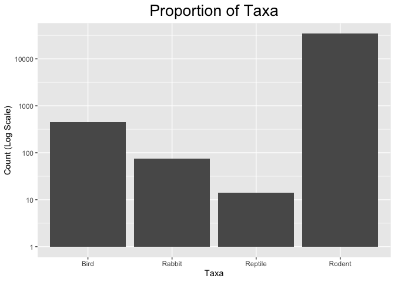
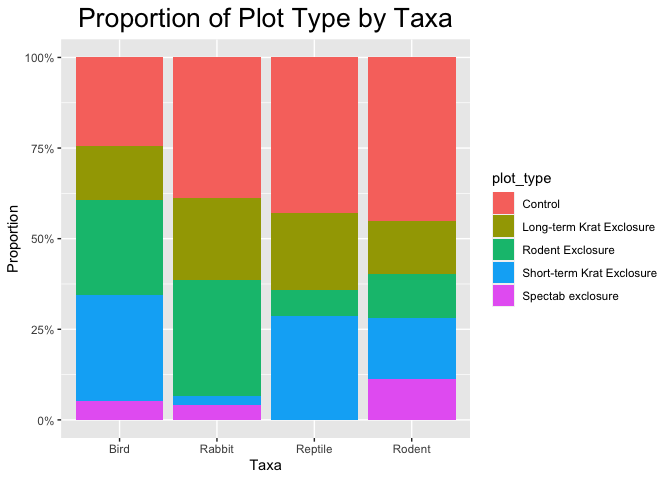
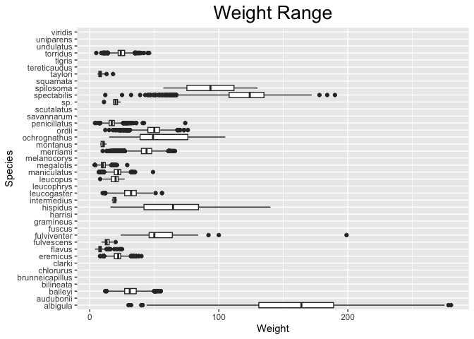
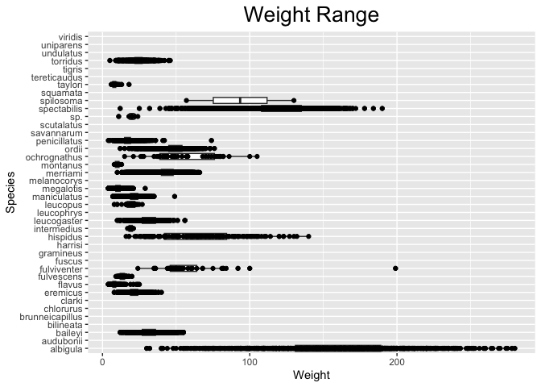
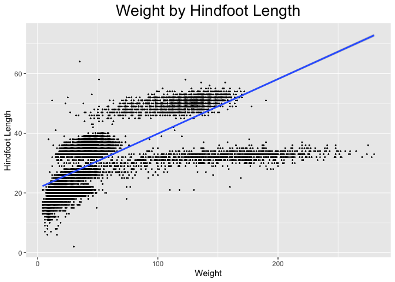
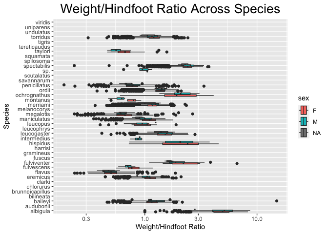
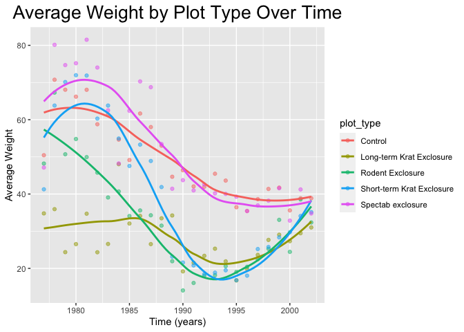

## Instructions
Answer the following questions and complete the exercises in RMarkdown. Please embed all of your code and push your final work to your repository. Your final lab report should be organized, clean, and run free from errors. Remember, you must remove the `#` for the included code chunks to run. Be sure to add your name to the author header above. For any included plots, make sure they are clearly labeled. You are free to use any plot type that you feel best communicates the results of your analysis.  

Make sure to use the formatting conventions of RMarkdown to make your report neat and clean!  

## Load the libraries

```r
library(tidyverse)
library(janitor)
library(naniar)
```

## Desert Ecology
For this assignment, we are going to use a modified data set on [desert ecology](http://esapubs.org/archive/ecol/E090/118/). The data are from: S. K. Morgan Ernest, Thomas J. Valone, and James H. Brown. 2009. Long-term monitoring and experimental manipulation of a Chihuahuan Desert ecosystem near Portal, Arizona, USA. Ecology 90:1708.

```r
deserts <- read_csv("../data/surveys_complete.csv") %>% clean_names()
```

```
## Rows: 34786 Columns: 13
## ── Column specification ────────────────────────────────────────────────────────
## Delimiter: ","
## chr (6): species_id, sex, genus, species, taxa, plot_type
## dbl (7): record_id, month, day, year, plot_id, hindfoot_length, weight
## 
## ℹ Use `spec()` to retrieve the full column specification for this data.
## ℹ Specify the column types or set `show_col_types = FALSE` to quiet this message.
```

1. Use the function(s) of your choice to get an idea of its structure, including how NA's are treated. Are the data tidy?  


```r
glimpse(deserts)
```

```
## Rows: 34,786
## Columns: 13
## $ record_id       <dbl> 1, 2, 3, 4, 5, 6, 7, 8, 9, 10, 11, 12, 13, 14, 15, 16,…
## $ month           <dbl> 7, 7, 7, 7, 7, 7, 7, 7, 7, 7, 7, 7, 7, 7, 7, 7, 7, 7, …
## $ day             <dbl> 16, 16, 16, 16, 16, 16, 16, 16, 16, 16, 16, 16, 16, 16…
## $ year            <dbl> 1977, 1977, 1977, 1977, 1977, 1977, 1977, 1977, 1977, …
## $ plot_id         <dbl> 2, 3, 2, 7, 3, 1, 2, 1, 1, 6, 5, 7, 3, 8, 6, 4, 3, 2, …
## $ species_id      <chr> "NL", "NL", "DM", "DM", "DM", "PF", "PE", "DM", "DM", …
## $ sex             <chr> "M", "M", "F", "M", "M", "M", "F", "M", "F", "F", "F",…
## $ hindfoot_length <dbl> 32, 33, 37, 36, 35, 14, NA, 37, 34, 20, 53, 38, 35, NA…
## $ weight          <dbl> NA, NA, NA, NA, NA, NA, NA, NA, NA, NA, NA, NA, NA, NA…
## $ genus           <chr> "Neotoma", "Neotoma", "Dipodomys", "Dipodomys", "Dipod…
## $ species         <chr> "albigula", "albigula", "merriami", "merriami", "merri…
## $ taxa            <chr> "Rodent", "Rodent", "Rodent", "Rodent", "Rodent", "Rod…
## $ plot_type       <chr> "Control", "Long-term Krat Exclosure", "Control", "Rod…
```

It looks like NAs are treated normally in the data set. The data is tidy.

2. How many genera and species are represented in the data? What are the total number of observations? Which species is most/ least frequently sampled in the study?


```r
deserts %>%
  group_by(genus, species) %>%
  count()
```

```
## # A tibble: 48 × 3
## # Groups:   genus, species [48]
##    genus            species             n
##    <chr>            <chr>           <int>
##  1 Ammodramus       savannarum          2
##  2 Ammospermophilus harrisi           437
##  3 Amphispiza       bilineata         303
##  4 Baiomys          taylori            46
##  5 Calamospiza      melanocorys        13
##  6 Callipepla       squamata           16
##  7 Campylorhynchus  brunneicapillus    50
##  8 Chaetodipus      baileyi          2891
##  9 Chaetodipus      intermedius         9
## 10 Chaetodipus      penicillatus     3123
## # ℹ 38 more rows
```


```r
count(deserts)
```

```
## # A tibble: 1 × 1
##       n
##   <int>
## 1 34786
```


```r
deserts %>%
  count(species) %>%
  arrange(n) %>%
  head()
```

```
## # A tibble: 6 × 2
##   species          n
##   <chr>        <int>
## 1 clarki           1
## 2 scutalatus       1
## 3 tereticaudus     1
## 4 tigris           1
## 5 uniparens        1
## 6 viridis          1
```


```r
deserts %>%
  count(species) %>%
  arrange(desc(n)) %>%
  head(1)
```

```
## # A tibble: 1 × 2
##   species      n
##   <chr>    <int>
## 1 merriami 10596
```

3. What is the proportion of taxa included in this study? Show a table and plot that reflects this count.


```r
tabyl(deserts$taxa)
```

```
##  deserts$taxa     n      percent
##          Bird   450 0.0129362387
##        Rabbit    75 0.0021560398
##       Reptile    14 0.0004024608
##        Rodent 34247 0.9845052607
```


```r
deserts %>%
  ggplot(aes(x = taxa)) +
  geom_bar() +
  scale_y_log10() +
  labs(title = "Proportion of Taxa",
       x = "Taxa",
       y = "Count (Log Scale)") +
  theme(plot.title = element_text(hjust = 0.5, size = 20))
```

<!-- -->

4. For the taxa included in the study, use the fill option to show the proportion of individuals sampled by `plot_type.`


```r
deserts %>%
  ggplot(aes(x = taxa, fill = plot_type)) +
  geom_bar(position = position_fill()) +
  scale_y_continuous(labels = scales::percent) +
  labs(title = "Proportion of Plot Type by Taxa",
       x = "Taxa",
       y = "Proportion") +
  theme(plot.title = element_text(hjust = 0.5, size = 20))
```

<!-- -->

5. What is the range of weight for each species included in the study? Remove any observations of weight that are NA so they do not show up in the plot.


```r
deserts %>%
  ggplot(aes(x = weight, y = species)) +
  geom_boxplot(na.rm = T) +
  labs(title = "Weight Range",
       x = "Weight",
       y = "Species") +
  theme(plot.title = element_text(hjust = 0.5, size = 20))
```

<!-- -->

6. Add another layer to your answer from #5 using `geom_point` to get an idea of how many measurements were taken for each species.


```r
deserts %>%
  ggplot(aes(x = weight, y = species)) +
  geom_boxplot(na.rm = T) +
  geom_point(na.rm = T) +
  labs(title = "Weight Range",
       x = "Weight",
       y = "Species") +
  theme(plot.title = element_text(hjust = 0.5, size = 20))
```

<!-- -->

7. [Dipodomys merriami](https://en.wikipedia.org/wiki/Merriam's_kangaroo_rat) is the most frequently sampled animal in the study. How have the number of observations of this species changed over the years included in the study?


```r
deserts %>%
  group_by(year) %>%
  summarise(number_of_observations = n())
```

```
## # A tibble: 26 × 2
##     year number_of_observations
##    <dbl>                  <int>
##  1  1977                    487
##  2  1978                    992
##  3  1979                    658
##  4  1980                   1375
##  5  1981                   1417
##  6  1982                   1964
##  7  1983                   1652
##  8  1984                    951
##  9  1985                   1416
## 10  1986                    922
## # ℹ 16 more rows
```


```r
deserts %>%
  group_by(year) %>%
  summarise(number_of_observations = n()) %>%
  ggplot(aes(x = year, y = number_of_observations)) +
  geom_line() +
  labs(title = "Number of Observations Over Time",
       x = "Time (years)",
       y = "Number of Observations") +
  theme(plot.title = element_text(hjust = 0.5, size = 20))
```

<!-- -->

8. What is the relationship between `weight` and `hindfoot` length? Consider whether or not over plotting is an issue.


```r
deserts %>%
  ggplot(aes(x = weight, y = hindfoot_length)) +
  geom_point(size = 0.25) +
  geom_smooth(method = lm) +
  labs(title = "Weight by Hindfoot Length",
       x = "Weight",
       y = "Hindfoot Length") +
  theme(plot.title = element_text(hjust = 0.5, size = 20))
```

```
## `geom_smooth()` using formula = 'y ~ x'
```

```
## Warning: Removed 4048 rows containing non-finite values (`stat_smooth()`).
```

```
## Warning: Removed 4048 rows containing missing values (`geom_point()`).
```

<!-- -->

There are a lot of points, so we should definitely consider plotting in a different way. The linear model is also not appropriate for this graph.

9. Which two species have, on average, the highest weight? Once you have identified them, make a new column that is a ratio of `weight` to `hindfoot_length`. Make a plot that shows the range of this new ratio and fill by sex.


```r
deserts %>%
  group_by(species) %>%
  summarise(mean_weight = mean(weight, na.rm = T)) %>%
  arrange(desc(mean_weight)) %>%
  head(2)
```

```
## # A tibble: 2 × 2
##   species     mean_weight
##   <chr>             <dbl>
## 1 albigula           159.
## 2 spectabilis        120.
```


```r
deserts %>%
  mutate(weight_hindfoot_ratio = weight/hindfoot_length) %>%
  ggplot(aes(x = weight_hindfoot_ratio, y = species, fill = sex)) +
  geom_boxplot() + 
  scale_x_log10() +
  labs(title = "Weight/Hindfoot Ratio Across Species",
       x = "Weight/Hindfoot Ratio",
       y = "Species") +
  theme(plot.title = element_text(hjust = 0.5, size = 20))
```

```
## Warning: Removed 4048 rows containing non-finite values (`stat_boxplot()`).
```

<!-- -->

10. Make one plot of your choice! Make sure to include at least two of the aesthetics options you have learned.


```r
deserts %>%
  group_by(year, plot_type) %>%
  summarise(mean_weight = mean(weight, na.rm = T)) %>%
  ggplot(aes( x = year, y = mean_weight, color = plot_type)) +
  geom_point(alpha = 0.5) + 
  geom_smooth(se = F) +
  labs(title = "Average Weight by Plot Type Over Time",
       x = "Time (years)",
       y = "Average Weight") +
  theme(plot.title = element_text(hjust = 0.5, size = 20))
```

```
## `summarise()` has grouped output by 'year'. You can override using the
## `.groups` argument.
## `geom_smooth()` using method = 'loess' and formula = 'y ~ x'
```

<!-- -->

## Push your final code to GitHub!
Please be sure that you check the `keep md` file in the knit preferences. 
