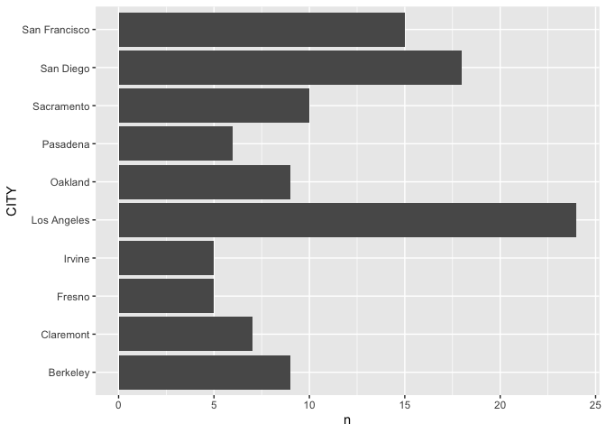
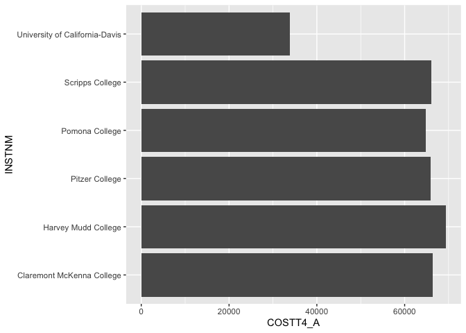
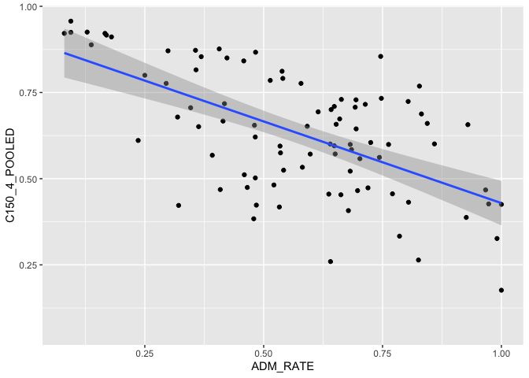
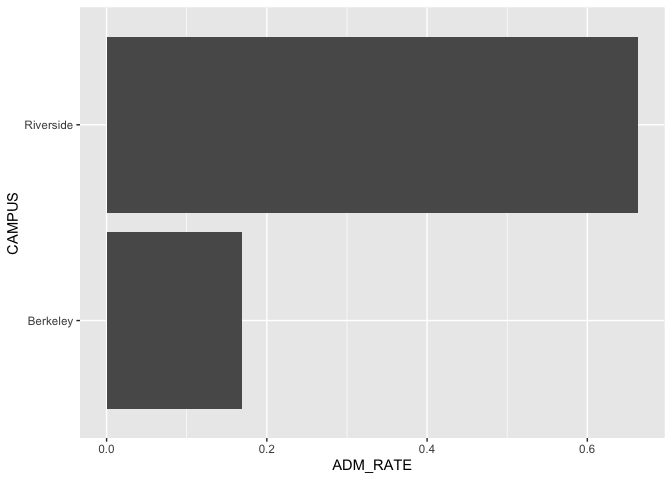
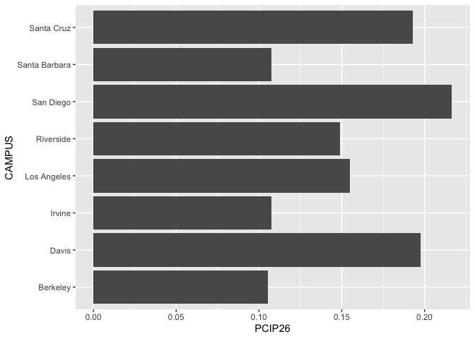

## Instructions
Answer the following questions and complete the exercises in RMarkdown. Please embed all of your code and push your final work to your repository. Your final lab report should be organized, clean, and run free from errors. Remember, you must remove the `#` for the included code chunks to run. Be sure to add your name to the author header above.  

Make sure to use the formatting conventions of RMarkdown to make your report neat and clean!  

## Load the libraries

```r
library(tidyverse)
library(janitor)
library(here)
library(naniar)
```

For this homework, we will take a departure from biological data and use data about California colleges. These data are a subset of the national college scorecard (https://collegescorecard.ed.gov/data/). Load the `ca_college_data.csv` as a new object called `colleges`.

```r
colleges <- read_csv("../data/ca_college_data.csv")
```

```
## Rows: 341 Columns: 10
## ── Column specification ────────────────────────────────────────────────────────
## Delimiter: ","
## chr (4): INSTNM, CITY, STABBR, ZIP
## dbl (6): ADM_RATE, SAT_AVG, PCIP26, COSTT4_A, C150_4_POOLED, PFTFTUG1_EF
## 
## ℹ Use `spec()` to retrieve the full column specification for this data.
## ℹ Specify the column types or set `show_col_types = FALSE` to quiet this message.
```

The variables are a bit hard to decipher, here is a key:  

INSTNM: Institution name  
CITY: California city  
STABBR: Location state  
ZIP: Zip code  
ADM_RATE: Admission rate  
SAT_AVG: SAT average score  
PCIP26: Percentage of degrees awarded in Biological And Biomedical Sciences  
COSTT4_A: Annual cost of attendance  
C150_4_POOLED: 4-year completion rate  
PFTFTUG1_EF: Percentage of undergraduate students who are first-time, full-time degree/certificate-seeking undergraduate students  

1. Use your preferred function(s) to have a look at the data and get an idea of its structure. Make sure you summarize NA's and determine whether or not the data are tidy. You may also consider dealing with any naming issues.


```r
glimpse(colleges)
```

```
## Rows: 341
## Columns: 10
## $ INSTNM        <chr> "Grossmont College", "College of the Sequoias", "College…
## $ CITY          <chr> "El Cajon", "Visalia", "San Mateo", "Ventura", "Oxnard",…
## $ STABBR        <chr> "CA", "CA", "CA", "CA", "CA", "CA", "CA", "CA", "CA", "C…
## $ ZIP           <chr> "92020-1799", "93277-2214", "94402-3784", "93003-3872", …
## $ ADM_RATE      <dbl> NA, NA, NA, NA, NA, NA, NA, NA, NA, NA, NA, NA, NA, NA, …
## $ SAT_AVG       <dbl> NA, NA, NA, NA, NA, NA, NA, NA, NA, NA, NA, NA, NA, NA, …
## $ PCIP26        <dbl> 0.0016, 0.0066, 0.0038, 0.0035, 0.0085, 0.0151, 0.0000, …
## $ COSTT4_A      <dbl> 7956, 8109, 8278, 8407, 8516, 8577, 8580, 9181, 9281, 93…
## $ C150_4_POOLED <dbl> NA, NA, NA, NA, NA, NA, 0.2334, NA, NA, NA, NA, 0.1704, …
## $ PFTFTUG1_EF   <dbl> 0.3546, 0.5413, 0.3567, 0.3824, 0.2753, 0.4286, 0.2307, …
```

2. Which cities in California have the highest number of colleges?


```r
colleges %>%
  group_by(CITY) %>%
  count() %>%
  arrange(desc(n)) %>%
  head(10)
```

```
## # A tibble: 10 × 2
## # Groups:   CITY [10]
##    CITY              n
##    <chr>         <int>
##  1 Los Angeles      24
##  2 San Diego        18
##  3 San Francisco    15
##  4 Sacramento       10
##  5 Berkeley          9
##  6 Oakland           9
##  7 Claremont         7
##  8 Pasadena          6
##  9 Fresno            5
## 10 Irvine            5
```

3. Based on your answer to #2, make a plot that shows the number of colleges in the top 10 cities.


```r
colleges %>%
  group_by(CITY) %>%
  count() %>%
  arrange(desc(n)) %>%
  head(10) %>%
  ggplot(aes(x = CITY, y = n)) +
  geom_col() +
  coord_flip()
```

<!-- -->

4. The column `COSTT4_A` is the annual cost of each institution. Which city has the highest average cost? Where is it located?


```r
colleges %>%
  group_by(CITY, STABBR) %>%
  summarise(average_cost = mean(COSTT4_A, na.rm = T)) %>%
  arrange(desc(average_cost)) # Claremont, CA
```

```
## `summarise()` has grouped output by 'CITY'. You can override using the
## `.groups` argument.
```

```
## # A tibble: 161 × 3
## # Groups:   CITY [161]
##    CITY                STABBR average_cost
##    <chr>               <chr>         <dbl>
##  1 Claremont           CA            66498
##  2 Malibu              CA            66152
##  3 Valencia            CA            64686
##  4 Orange              CA            64501
##  5 Redlands            CA            61542
##  6 Moraga              CA            61095
##  7 Atherton            CA            56035
##  8 Thousand Oaks       CA            54373
##  9 Rancho Palos Verdes CA            50758
## 10 La Verne            CA            50603
## # ℹ 151 more rows
```

5. Based on your answer to #4, make a plot that compares the cost of the individual colleges in the most expensive city. Bonus! Add UC Davis here to see how it compares :>).


```r
colleges %>%
  filter(CITY == "Claremont" | CITY == "Davis") %>%
  filter(!is.na(COSTT4_A)) %>%
  ggplot(aes(x = COSTT4_A, y = INSTNM)) +
  geom_col()
```

<!-- -->

6. The column `ADM_RATE` is the admissions rate by college and `C150_4_POOLED` is the four-year completion rate. Use a scatterplot to show the relationship between these two variables. What do you think this means?


```r
ggplot(data = colleges,
       mapping = aes(x = ADM_RATE, y = C150_4_POOLED)) +
  geom_point() +
  geom_smooth(method = lm)
```

```
## `geom_smooth()` using formula = 'y ~ x'
```

```
## Warning: Removed 251 rows containing non-finite values (`stat_smooth()`).
```

```
## Warning: Removed 251 rows containing missing values (`geom_point()`).
```

<!-- -->

It looks like the higher the admission rate is, the smaller the proportion of four-year completion. It seems that the harder it is to be admitted into a certain school, the harder the student tries to complete all 4 years.

7. Is there a relationship between cost and four-year completion rate? (You don't need to do the stats, just produce a plot). What do you think this means?


```r
colleges %>%
ggplot(aes(x = COSTT4_A, y = C150_4_POOLED)) +
  geom_point() + 
  geom_smooth(method = lm)
```

```
## `geom_smooth()` using formula = 'y ~ x'
```

```
## Warning: Removed 225 rows containing non-finite values (`stat_smooth()`).
```

```
## Warning: Removed 225 rows containing missing values (`geom_point()`).
```

<!-- -->

There is a positive corelation between cost of attendance and completion rate. It seems that the steeper the cost, the higher the investment, the more likely the student is to complete all 4 years.

8. The column titled `INSTNM` is the institution name. We are only interested in the University of California colleges. Make a new data frame that is restricted to UC institutions. You can remove `Hastings College of Law` and `UC San Francisco` as we are only interested in undergraduate institutions.

Remove `Hastings College of Law` and `UC San Francisco` and store the final data frame as a new object `univ_calif_final`.

Use `separate()` to separate institution name into two new columns "UNIV" and "CAMPUS".


```r
univ_calif_final <- colleges %>%
  separate('INSTNM', into = c('UNIV', 'CAMPUS'), sep = "-") %>%
  filter(UNIV == "University of California") %>%
  filter(CAMPUS != "Hastings College of Law") %>%
  filter(CAMPUS != "San Francisco")
```

```
## Warning: Expected 2 pieces. Additional pieces discarded in 9 rows [140, 145, 165, 173,
## 177, 292, 298, 299, 300].
```

```
## Warning: Expected 2 pieces. Missing pieces filled with `NA` in 264 rows [1, 2, 3, 4, 5,
## 6, 7, 8, 9, 10, 11, 12, 13, 14, 15, 16, 17, 18, 19, 20, ...].
```

9. The column `ADM_RATE` is the admissions rate by campus. Which UC has the lowest and highest admissions rates? Produce a numerical summary and an appropriate plot.


```r
univ_calif_final %>%
  arrange(ADM_RATE) %>%
  select(UNIV, CAMPUS, ADM_RATE) # Berkeley (lowest) and Riverside (highest)
```

```
## # A tibble: 8 × 3
##   UNIV                     CAMPUS        ADM_RATE
##   <chr>                    <chr>            <dbl>
## 1 University of California Berkeley         0.169
## 2 University of California Los Angeles      0.180
## 3 University of California San Diego        0.357
## 4 University of California Santa Barbara    0.358
## 5 University of California Irvine           0.406
## 6 University of California Davis            0.423
## 7 University of California Santa Cruz       0.578
## 8 University of California Riverside        0.663
```


```r
univ_calif_final %>%
  filter(CAMPUS == 'Berkeley' | CAMPUS == 'Riverside') %>%
  ggplot(aes(x = ADM_RATE, y = CAMPUS)) +
  geom_col()
```

<!-- -->

10. If you wanted to get a degree in biological or biomedical sciences, which campus confers the majority of these degrees? Produce a numerical summary and an appropriate plot.


```r
univ_calif_final %>%
  arrange(desc(PCIP26)) %>%
  select(UNIV, CAMPUS, PCIP26) %>%
  head(1)
```

```
## # A tibble: 1 × 3
##   UNIV                     CAMPUS    PCIP26
##   <chr>                    <chr>      <dbl>
## 1 University of California San Diego  0.216
```


```r
univ_calif_final %>%
  ggplot(aes(x = PCIP26, y = CAMPUS)) +
  geom_col()
```

<!-- -->

University of California, San Diego is the highest.

## Knit Your Output and Post to [GitHub](https://github.com/FRS417-DataScienceBiologists)
