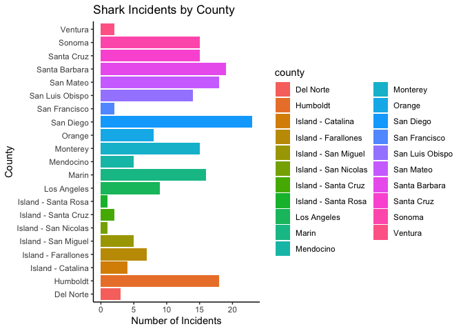
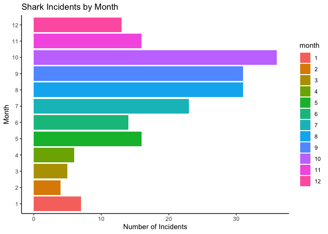
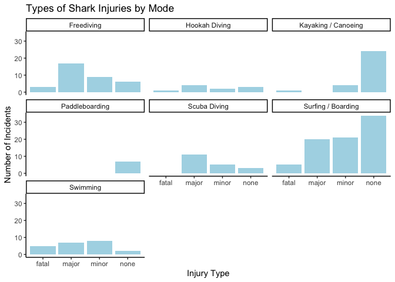
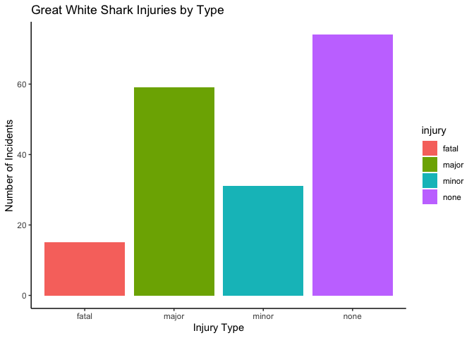
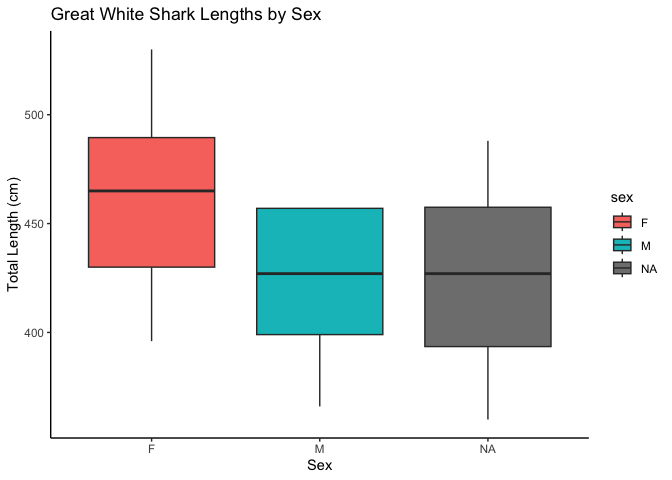
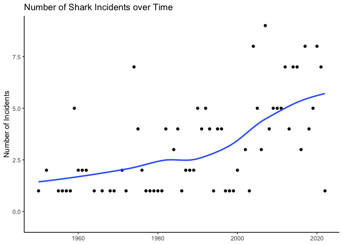

## Instructions
Answer the following questions and complete the exercises in RMarkdown. Please embed all of your code and push your final work to your repository. Your code must be organized, clean, and run free from errors. Remember, you must remove the `#` for any included code chunks to run. Be sure to add your name to the author header above. 

Your code must knit in order to be considered. If you are stuck and cannot answer a question, then comment out your code and knit the document. You may use your notes, labs, and homework to help you complete this exam. Do not use any other resources- including AI assistance.  

Don't forget to answer any questions that are asked in the prompt. Some questions will require a plot, but others do not- make sure to read each question carefully.  

For the questions that require a plot, make sure to have clearly labeled axes and a title. Keep your plots clean and professional-looking, but you are free to add color and other aesthetics.  

Be sure to follow the directions and upload your exam on Gradescope.    

## Background
In the `data` folder, you will find data about shark incidents in California between 1950-2022. The [data](https://catalog.data.gov/dataset/shark-incident-database-california-56167) are from: State of California- Shark Incident Database.   

## Load the libraries

```r
library("tidyverse")
library("janitor")
library("naniar")
```

## Load the data
Run the following code chunk to import the data.

```r
sharks <- read_csv("data/SharkIncidents_1950_2022_220302.csv") %>% clean_names()
```

## Questions
1. (1 point) Start by doing some data exploration using your preferred function(s). What is the structure of the data? Where are the missing values and how are they represented?  


```r
glimpse(sharks)
```

```
## Rows: 211
## Columns: 16
## $ incident_num     <chr> "1", "2", "3", "4", "5", "6", "7", "8", "9", "10", "1…
## $ month            <dbl> 10, 5, 12, 2, 8, 4, 10, 5, 6, 7, 10, 11, 4, 5, 5, 8, …
## $ day              <dbl> 8, 27, 7, 6, 14, 28, 12, 7, 14, 28, 4, 10, 24, 19, 21…
## $ year             <dbl> 1950, 1952, 1952, 1955, 1956, 1957, 1958, 1959, 1959,…
## $ time             <chr> "12:00", "14:00", "14:00", "12:00", "16:30", "13:30",…
## $ county           <chr> "San Diego", "San Diego", "Monterey", "Monterey", "Sa…
## $ location         <chr> "Imperial Beach", "Imperial Beach", "Lovers Point", "…
## $ mode             <chr> "Swimming", "Swimming", "Swimming", "Freediving", "Sw…
## $ injury           <chr> "major", "minor", "fatal", "minor", "major", "fatal",…
## $ depth            <chr> "surface", "surface", "surface", "surface", "surface"…
## $ species          <chr> "White", "White", "White", "White", "White", "White",…
## $ comment          <chr> "Body Surfing, bit multiple times on leg, thigh and b…
## $ longitude        <chr> "-117.1466667", "-117.2466667", "-122.05", "-122.15",…
## $ latitude         <dbl> 32.58833, 32.58833, 36.62667, 36.62667, 35.13833, 35.…
## $ confirmed_source <chr> "Miller/Collier, Coronado Paper, Oceanside Paper", "G…
## $ wfl_case_number  <chr> NA, NA, NA, NA, NA, NA, NA, NA, NA, NA, NA, NA, NA, N…
```


```r
miss_var_summary(sharks)
```

```
## # A tibble: 16 × 3
##    variable         n_miss pct_miss
##    <chr>             <int>    <dbl>
##  1 wfl_case_number     202   95.7  
##  2 time                  7    3.32 
##  3 latitude              6    2.84 
##  4 longitude             5    2.37 
##  5 confirmed_source      1    0.474
##  6 incident_num          0    0    
##  7 month                 0    0    
##  8 day                   0    0    
##  9 year                  0    0    
## 10 county                0    0    
## 11 location              0    0    
## 12 mode                  0    0    
## 13 injury                0    0    
## 14 depth                 0    0    
## 15 species               0    0    
## 16 comment               0    0
```
There are some NAs present in a few of of the columns. Missing times are both NAs and "Unknown". Species also has "Unknown".

2. (1 point) Notice that there are some incidents identified as "NOT COUNTED". These should be removed from the data because they were either not sharks, unverified, or were provoked. It's OK to replace the `sharks` object.


```r
sharks <- sharks %>%
  filter(incident_num != "NOT COUNTED")
```

3. (3 points) Are there any "hotspots" for shark incidents in California? Make a plot that shows the total number of incidents per county. Which county has the highest number of incidents?


```r
sharks %>%
  ggplot(aes(fill = county, x = county)) +
  geom_bar() +
  coord_flip() +
  labs(title = "Shark Incidents by County",
       y = "Number of Incidents",
       x = "County") +
  theme_classic()
```

<!-- -->

It looks like San Diego has the most amount of shark incidents.

4. (3 points) Are there months of the year when incidents are more likely to occur? Make a plot that shows the total number of incidents by month. Which month has the highest number of incidents?  


```r
sharks$month <- as.factor(sharks$month)
```


```r
sharks %>%
  group_by(month) %>%
  ggplot(aes(fill = month, x = month)) +
  geom_bar() +
  coord_flip() +
  labs(title = "Shark Incidents by Month",
       y = "Number of Incidents",
       x = "Month") +
  theme_classic()
```

<!-- -->

Most of the recorded incidents were in the 10th month (October).

5. (3 points) How do the number and types of injuries compare by county? Make a table (not a plot) that shows the number of injury types by county. Which county has the highest number of fatalities?  


```r
sharks %>%
  group_by(county, injury) %>%
  summarise(total =  n()) %>%
  pivot_wider(names_from = injury,
              values_from = total) %>%
  arrange(desc(fatal))
```

```
## `summarise()` has grouped output by 'county'. You can override using the
## `.groups` argument.
```

```
## # A tibble: 21 × 5
## # Groups:   county [21]
##    county              minor  none major fatal
##    <chr>               <int> <int> <int> <int>
##  1 San Luis Obispo         1     7     3     3
##  2 Monterey                2     3     8     2
##  3 San Diego               8     9     4     2
##  4 Santa Barbara           6     9     2     2
##  5 Island - San Miguel     2    NA     2     1
##  6 Los Angeles             6     2    NA     1
##  7 Mendocino               1    NA     3     1
##  8 San Francisco          NA     1    NA     1
##  9 San Mateo               4    12     1     1
## 10 Santa Cruz              3     8     3     1
## # ℹ 11 more rows
```

It looks like San Luis Obispo has the largest number of fatalities.

6. (2 points) In the data, `mode` refers to a type of activity. Which activity is associated with the highest number of incidents?


```r
sharks %>%
  group_by(mode) %>%
  summarise(total_incidents = n()) %>%
  arrange(desc(total_incidents))
```

```
## # A tibble: 7 × 2
##   mode                total_incidents
##   <chr>                         <int>
## 1 Surfing / Boarding               80
## 2 Freediving                       35
## 3 Kayaking / Canoeing              29
## 4 Swimming                         22
## 5 Scuba Diving                     19
## 6 Hookah Diving                    10
## 7 Paddleboarding                    7
```

It looks like "Surfing / Boarding" has the most amount of incidents reported.

7. (4 points) Use faceting to make a plot that compares the number and types of injuries by activity. (hint: the x axes should be the type of injury) 


```r
sharks %>%
  group_by(mode, injury) %>%
  ggplot(aes(x = injury)) +
  geom_bar(fill = "lightblue") +
  facet_wrap(~mode) +
  labs(title = "Types of Shark Injuries by Mode",
       x = "Injury Type",
       y = "Number of Incidents") +
  theme_classic()
```

<!-- -->

8. (1 point) Which shark species is involved in the highest number of incidents?  


```r
sharks %>%
  group_by(species) %>%
  summarise(total_incidents = n()) %>%
  arrange(desc(total_incidents))
```

```
## # A tibble: 8 × 2
##   species    total_incidents
##   <chr>                <int>
## 1 White                  179
## 2 Unknown                 13
## 3 Hammerhead               3
## 4 Blue                     2
## 5 Leopard                  2
## 6 Salmon                   1
## 7 Sevengill                1
## 8 Thresher                 1
```

Great White sharks are involved in the most incidents reported.

9. (3 points) Are all incidents involving Great White's fatal? Make a plot that shows the number and types of injuries for Great White's only.  


```r
sharks %>%
  filter(species == "White") %>%
  ggplot(aes(x = injury, fill = injury)) +
  geom_bar() +
  labs(title = "Great White Shark Injuries by Type",
       x = "Injury Type",
       y = "Number of Incidents") +
  theme_classic()
```

<!-- -->

It doesn't look like there are more fatalities than any other category. Most incidents resulted in no injury.

## Background
Let's learn a little bit more about Great White sharks by looking at a small dataset that tracked 20 Great White's in the Fallaron Islands. The [data](https://link.springer.com/article/10.1007/s00227-007-0739-4) are from: Weng et al. (2007) Migration and habitat of white sharks (_Carcharodon carcharias_) in the eastern Pacific Ocean.

## Load the data

```r
white_sharks <- read_csv("data/White sharks tracked from Southeast Farallon Island, CA, USA, 1999 2004.csv", na = c("?", "n/a")) %>% clean_names()
```

10. (1 point) Start by doing some data exploration using your preferred function(s). What is the structure of the data? Where are the missing values and how are they represented?


```r
glimpse(white_sharks)
```

```
## Rows: 20
## Columns: 10
## $ shark           <chr> "1-M", "2-M", "3-M", "4-M", "5-F", "6-M", "7-F", "8-M"…
## $ tagging_date    <chr> "19-Oct-99", "30-Oct-99", "16-Oct-00", "5-Nov-01", "5-…
## $ total_length_cm <dbl> 402, 366, 457, 457, 488, 427, 442, 380, 450, 530, 427,…
## $ sex             <chr> "M", "M", "M", "M", "F", "M", "F", "M", "M", "F", NA, …
## $ maturity        <chr> "Mature", "Adolescent", "Mature", "Mature", "Mature", …
## $ pop_up_date     <chr> "2-Nov-99", "25-Nov-99", "16-Apr-01", "6-May-02", "19-…
## $ track_days      <dbl> 14, 26, 182, 182, 256, 275, 35, 60, 209, 91, 182, 240,…
## $ longitude       <dbl> -124.49, -125.97, -156.80, -141.47, -133.25, -138.83, …
## $ latitude        <dbl> 38.95, 38.69, 20.67, 26.39, 21.13, 26.50, 37.07, 34.93…
## $ comment         <chr> "Nearshore", "Nearshore", "To Hawaii", "To Hawaii", "O…
```


```r
miss_var_summary(white_sharks)
```

```
## # A tibble: 10 × 3
##    variable        n_miss pct_miss
##    <chr>            <int>    <dbl>
##  1 sex                  3       15
##  2 maturity             1        5
##  3 longitude            1        5
##  4 latitude             1        5
##  5 shark                0        0
##  6 tagging_date         0        0
##  7 total_length_cm      0        0
##  8 pop_up_date          0        0
##  9 track_days           0        0
## 10 comment              0        0
```

It ooks like there are a few NAs, and there were some other marker's for NAs that was changed when we read in the csv.

11. (3 points) How do male and female sharks compare in terms of total length? Are males or females larger on average? Do a quick search online to verify your findings. (hint: this is a table, not a plot).  


```r
white_sharks %>%
  group_by(sex) %>%
  summarise(average_total_length_cm = mean(total_length_cm))
```

```
## # A tibble: 3 × 2
##   sex   average_total_length_cm
##   <chr>                   <dbl>
## 1 F                        462 
## 2 M                        425.
## 3 <NA>                     425
```

This is aligned with my online search, where females tend to be longer than males.

12. (3 points) Make a plot that compares the range of total length by sex.


```r
white_sharks %>%
  ggplot(aes(x = sex, y = total_length_cm, fill = sex)) +
  geom_boxplot() +
  labs(title = "Great White Shark Lengths by Sex",
       x = "Sex",
       y = "Total Length (cm)") +
  theme_classic()
```

<!-- -->

13. (2 points) Using the `sharks` or the `white_sharks` data, what is one question that you are interested in exploring? Write the question and answer it using a plot or table.  

I chose to explore: How does the total number of incidents vary per year? Does it increase, decrease, or stay the same?


```r
sharks %>%
  group_by(year) %>%
  summarise(total_incidents = n()) %>%
  ggplot(aes(x = year, y = total_incidents)) +
  geom_point() +
  geom_smooth(alpha = 0) +
  labs(title = "Number of Shark Incidents over Time",
       x = NULL,
       y = "Number of Incidents") +
  theme_classic()
```

```
## `geom_smooth()` using method = 'loess' and formula = 'y ~ x'
```

<!-- -->

